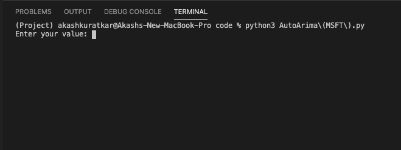
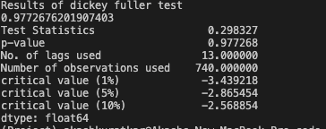
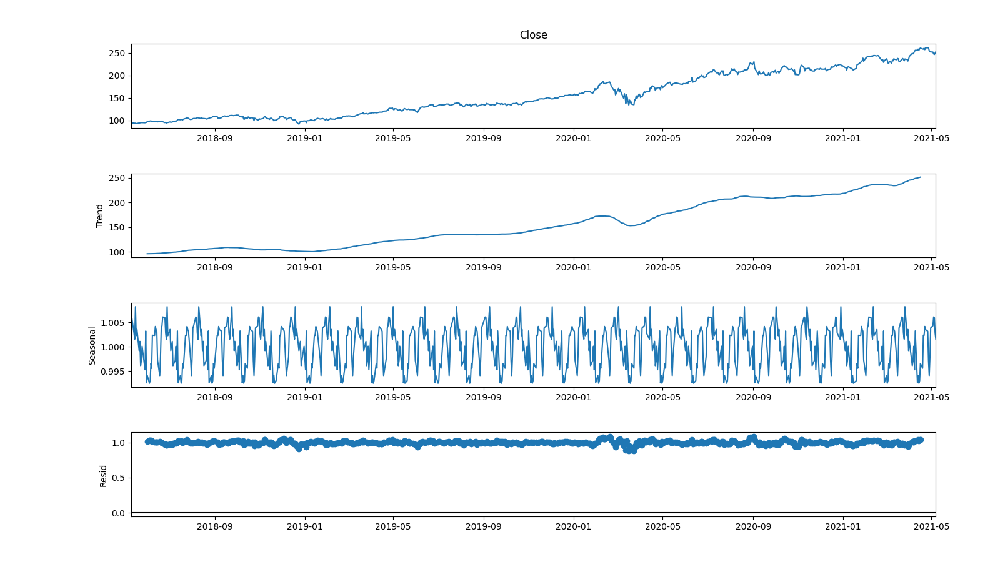
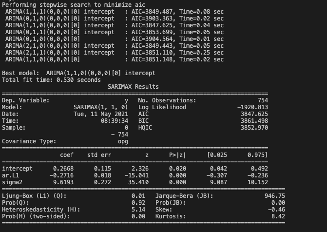
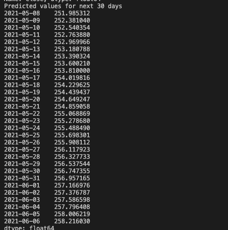
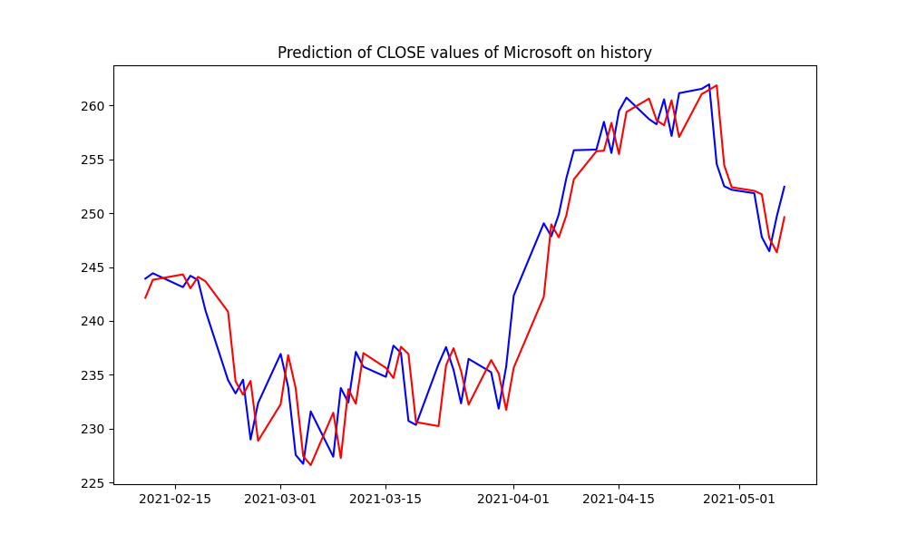
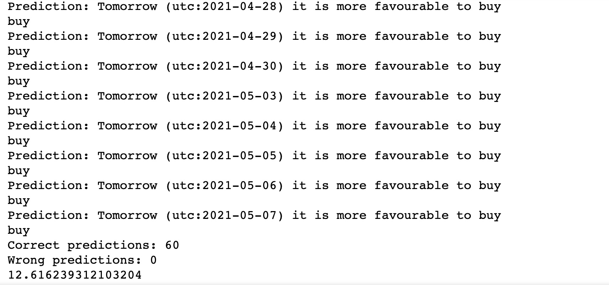
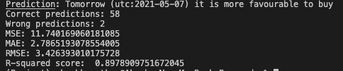
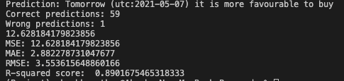
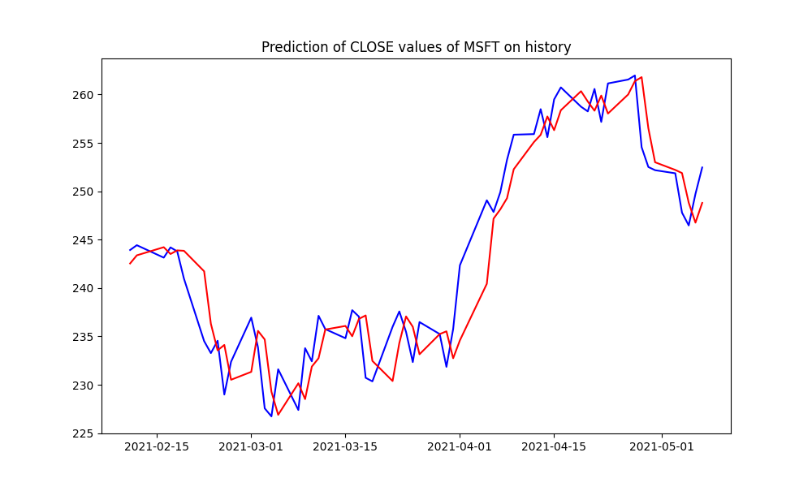

# USING ARIMA FOR STOCK TREND ANALYSIS AND ADVISE

## Expectation

Capture Stock trend and advise user best course of action: Buy/Sell/Hold stock.

The usecase is completely implemented. The algorithm can  produce future predictions and learn daily to correct its predictions for consequent days. 

## Overview

ARIMA is a time series based algorithm popular for future prediction and forecasting. It is used in this stock prediction predict to predict future stock trend and advise user based on that. 

There are various standard trading indicators used by investors to make decisions in stock analysis. Some standard trading indicators are:
* closing price
* open
* high
* low
* close
* volume

In this project, I have chosen closing price as our trading indicator.

## How to execute?

ARIMA implementation can either be visualized in jupyter notebook AutoArima(MSFT).ipynb or can be run from AutoArima(MSFT).py. File AutoArima(MSFT).py contains comment string which will give clear objective of all the functions that are used. The jupyter notebook also contains Notes which describe the actions in a comprehensive manner.  

**Steps to execute python file**

User is given various options to make any customization. Following command can be executed to see help options available:

**python3 stock_predictor.py --help**

User must enter stock symbol while executing python code. Here BRK-A is Berkshire Hathaway stock.
Following are steps to run ARIMA for stock trend and advise for Berkshire Hathaway stock:

1. Execute python3 stock_predictor.py 
2. Enter stokc name.
3. User can see graph of training and test data. For MSFT, it will look something like below:

4. After closing the graph, user will see that model training starts as follows:

5. Once you input stock name, user will see closing price graph of particular stock

6.As ARIMA works on non-stationary data, program will do stationary check usin ADF test. User will see result of stationary test like below

7. If -p value is greater than 0.05 then we cannot reject the Null hypothesis.In order to perform a time series analysis, we may need to separate seasonality and trend from our series. The resultant series will become stationary through this process. You can see seasonal decompose graph after decomposing process like below.

8. In order to train ARIMA model we need three different coeffiecients i.e P,Q and D. Running autoarima model will give us the best values of these three variables as shown below

9. Then program will train ARIMA model using those coefficients and will show forcasted values for stock like below.
  
  
10. Now program will go back with 60 days and will start predicting values from that day using trained data(traindata=dataframe-60days,testdata=dataframe-traindata). It will start from -60th day and start predicting values for each day and will compare it with actual price on next day. After comparision it will again train itself and predic values for next day. Predicted values and actual values graph will be shown after this process.

 

Meanwhile in console, user can see tomorrow's prediction, its accuracy and rmse as follows:

NOTE:There will be model process logs printing while making predictions.

## S-ARIMA for seasonal time-series prediction:
If there is significant changes in seasonal time-series graph then we can say like there is a seasonal impact on the data and we need to consider this impact to predict values for the future. Fo that there is one more algorithm i.e Seasonal Arima which works best on seasonal timeseries input data. This algorithm does not apllies to all the stocks. Program has implementation of S-ARIMA and it will also run this algorithm in order to perform prediction. After running this program you will see below results.

## Logic for Buy and Sell Stock explanation:

I devised this algo which takes 60 day average and then compares next day's prediction. If next day is higher than today, then Sell will be advised, if it is less than today then buy will be advised, else Hold will be advised.

## Feature selection, improvements and parameter tuning:

1. Tested stationarity of timeseries.
2. Seasonal decompose by checking -p value.
3. Processed Auto-Arima model to find best values for P,Q and D.
4. Predicted single day walk forward value using coefficients.
5. Provided suggestion to buys or sell after comparing it with last 60 days avarage mean of train data and then compared it with actual data.
6. Everyday learning process of model.
