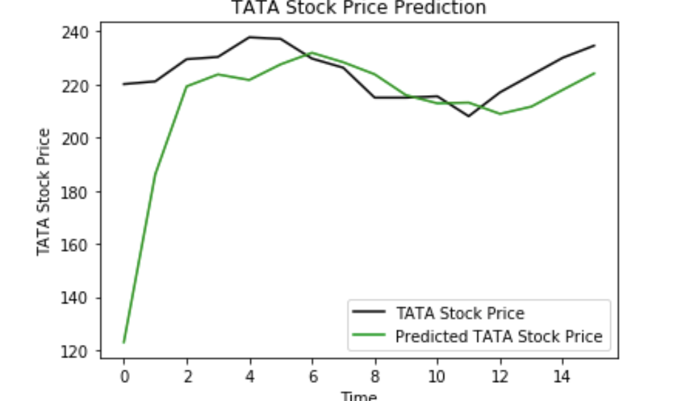
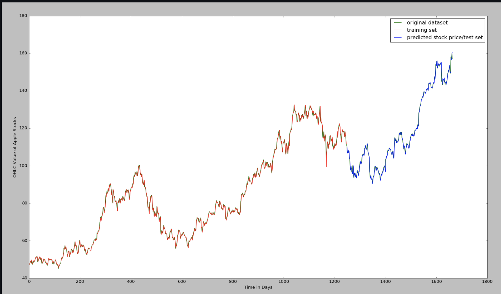
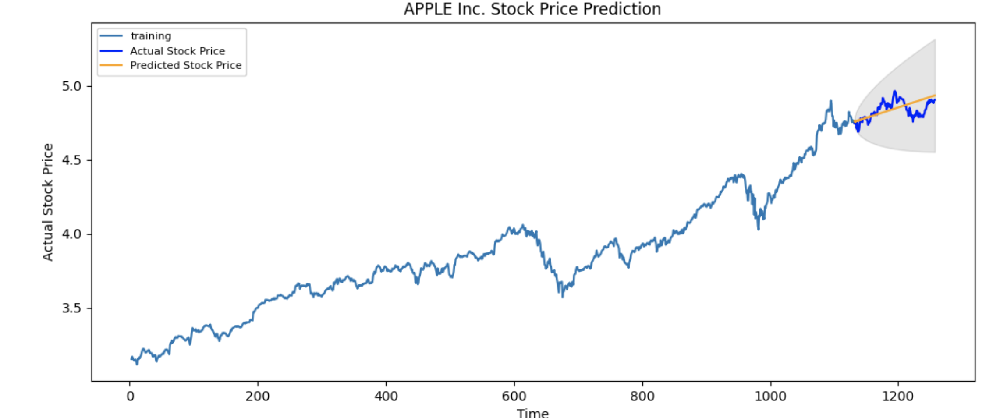

# Stock Price Predictions

**PROBLEM STATEMENT**

This stock prediction application will predict trend of the stock. It will also suggest the user whether it is a good time to buy this particular stock or sell it. 

Accuracy of the trend can be verified from the real-time data we are using by visualizing in the graph.

**Data Set**

We are using yfinance to take real time data of stocks. This api allows user to get data based on any given time-frame.

## Techniques for Stock Prediction

**1. LSTM(Long Short Term Memory) (Komal)**

Following link is used to understand about LSTM:

[LSTM](https://colah.github.io/posts/2015-08-Understanding-LSTMs/)

Expected visualization:

We can use the trend of the above graph advise user whether to buy or sell stock.

**Tools and Libraries**:

sklearn, keras, matplotlib, pandas, yfinance and numpy.

**2. Auto-ARIMA(‘Auto Regressive Integrated Moving Average’) (Akash)**

Following link is used to understand about Auto-ARIMA:

[AUTO-ARIMA](https://www.machinelearningplus.com/time-series/arima-model-time-series-forecasting-python/#:~:text=ARIMA%2C%20short%20for%20'AutoRegressive%20Integrated,to%20predict%20the%20future%20values)

**Tools and Libraries**:
sklearn, matplotlib, pandas, yfinance, numpy and statsmodels.

**3. KNN(k-Nearest Neighbours Regression) (Neha Poonia)**

Following link is used to understand about KNN:

[KNN](https://towardsdatascience.com/machine-learning-basics-with-the-k-nearest-neighbors-algorithm-6a6e71d01761)

**4. Support Vector Machine (Anagha)** 
[PREDICTION USING SVM](https://www.sciencedirect.com/science/article/pii/S2405918818300060)

**Tools and Libraries**:

sklearn, matplotlib, pandas, yfinance, numpy and math

  

5. Random Forest Regression
