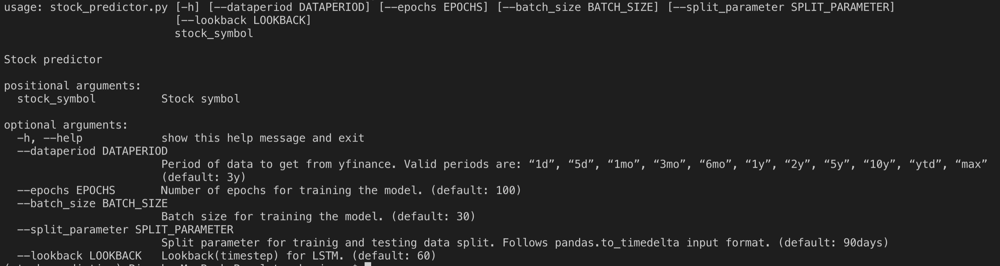
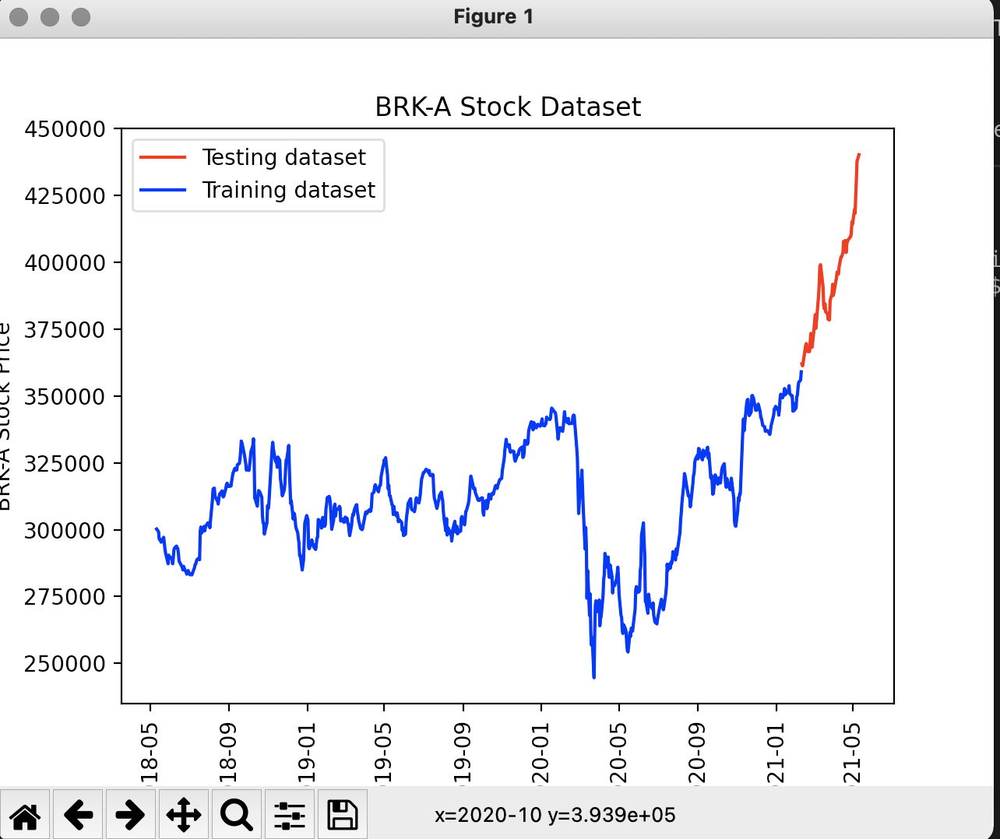
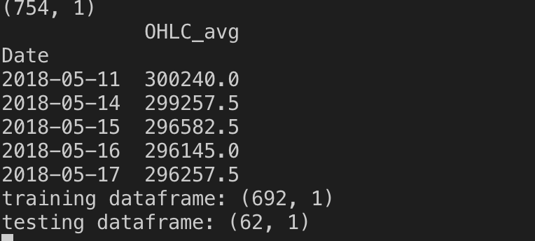
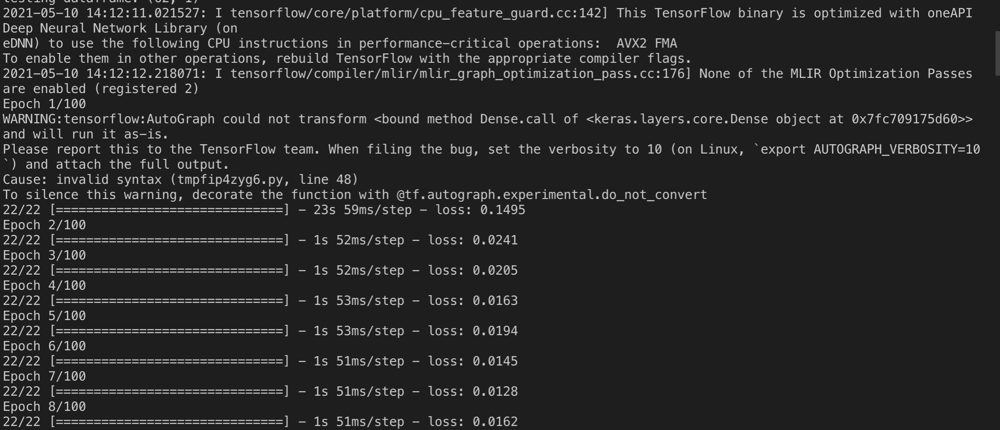
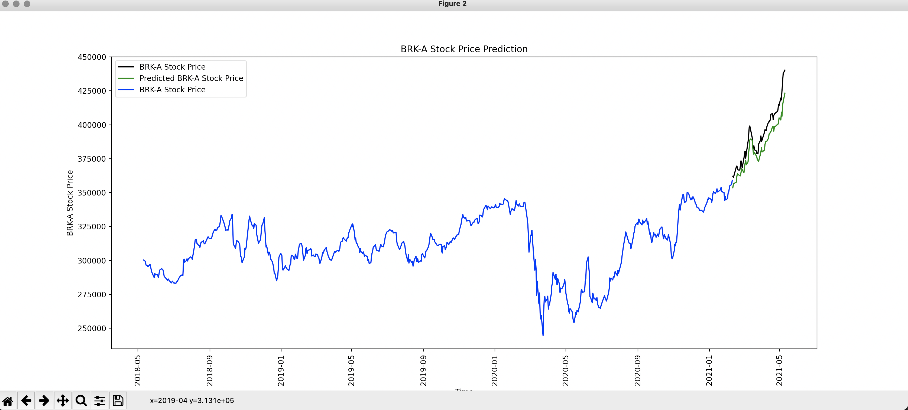
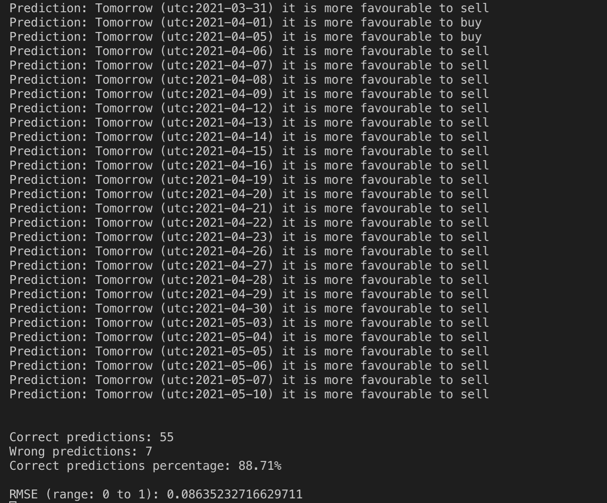
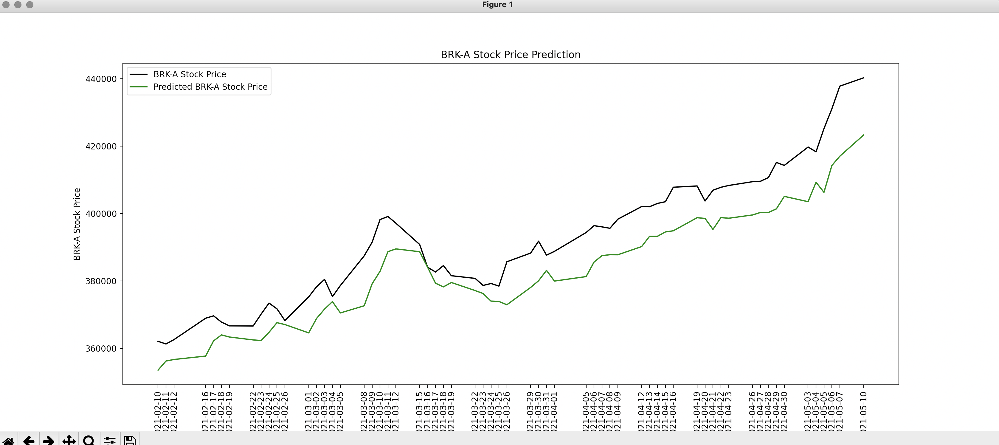

# USING LSTM FOR STOCK TREND ANALYSIS AND ADVISE

## Expectation

Capture Stock trend and advise user best course of action: Buy/Sell/Hold stock.

The usecase is completely implemented. The algorithm can  produce future predictions and learn daily to correct its predictions for consequent days. 

## Overview

LSTM is a time series based algorithm known to provide good results for future prediction and forecasting. It is used in this stock prediction predict to predict future stock trend and advise user based on that. 

There are various standard trading indicators used by investors to make decisions in stock analysis. Some standard trading indicators are:
* closing price
* hlc average (mean of high, low and closing share price)
* ohlc average (mean of open, high, low and closing share price)
etc...

In this project, I have chosen OHLC average as our trading indicator.

## How to execute?

First of all, install required dependencies using following command:

   pip install -r requirements.txt

LSTM implementation can either be visualized in jupyter notebook lstm.ipynb or can be run from stock_predictor.py. File stock_predictor.py contains doc string which will give clear objective of all the functions that are used. The jupyter notebook also contains Notes which describe the actions in a comprehensive manner.  

You can also see demo video of LSTM on link: https://drive.google.com/file/d/1FcGU5Ud9WL1bsPm7YzDLlBmFKEwZiSxP/view?usp=sharing

**Steps to execute python file**

User is given various options to make any customization. Following command can be executed to see help options available:

**python3 stock_predictor.py --help**

User must enter stock symbol while executing python code: **python3 stock_predictor.py BRK-A**. Here BRK-A is Berkshire Hathaway stock.
Following are steps to run lstm for stock trend and advise for Berkshire Hathaway stock:

1. Execute python3 stock_predictor.py BRK-A
2. User can see graph of training and test data. For BRK-A, it will look something like below:

During this time, in console, user can see a glimpse of ohlc average, training and testing data shape:

3. After closing the graph, user will see that model training starts as follows:

In case of any warning(as can be seen in image), just ignore those.

4. Once the model has trained, user can now visualize a graph which shows predicted value with respect to actual value with respect to entire graph as follows:

Meanwhile in console, user can see tomorrow's prediction, its accuracy and rmse as follows:

Once you close first graph, user will see another graph which shows graph visualization of actual test data with respect to predicted outcome as follows:

User can also see simple prediction for tomorrow by just executing following command:

   python3 stock_predictor.py msft --advice_for_tomorrow --dataperiod "6mo" --epochs 1

Here, Microsoft stock's tomorrow's prediction will be forecasted. --dataperiod tells yfinance to operate on only 6 months of data. Meaning of these optionals can be seen in demo video and above image of help.

## Logic for Buy and Sell Stock explanation:

There are many applications like robinhood which have their own suggestions based on their own development discussions. Upon exploring robinhood's buy and sell mechanism for continuous days, I came to the conclusion that it works on the principle of average comparison. Taking inspiration from that, I devised this algo which takes 30 day average and then compares next day's prediction. If next day is higher than today, then Sell will be advised, if it is less than today then buy will be advised, else Hold will be advised.

## Feature selection, improvements and parameter tuning:

1. Created multiple layers for LSTM
2. Provided variable scaling based on time period to ensure a very small value of past does not get nullified with respect to present. In stocks, we see that stock might have a very low value in the past but can be more than 1000% up today as part of a general market inflation. So, a very small value of the long past might seem 0 if we compare it with respect to today. To tackle this, I am scaling my data for every 700 entries (~3y).
3. Used OHLC average instead of Close data as OHLC incorporates more stock data information.

